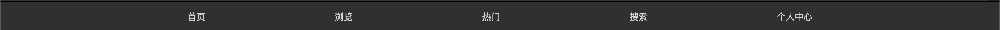
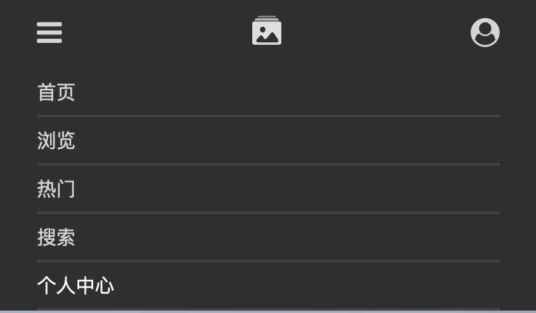
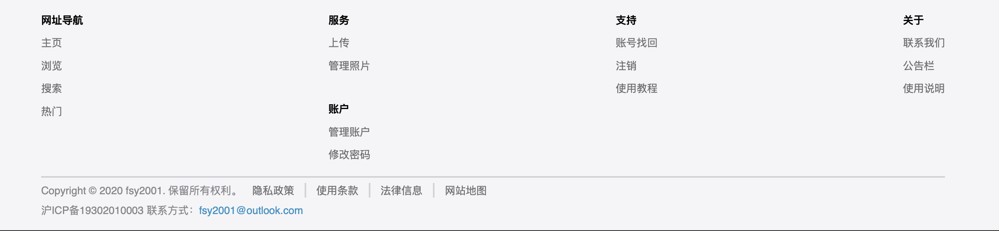
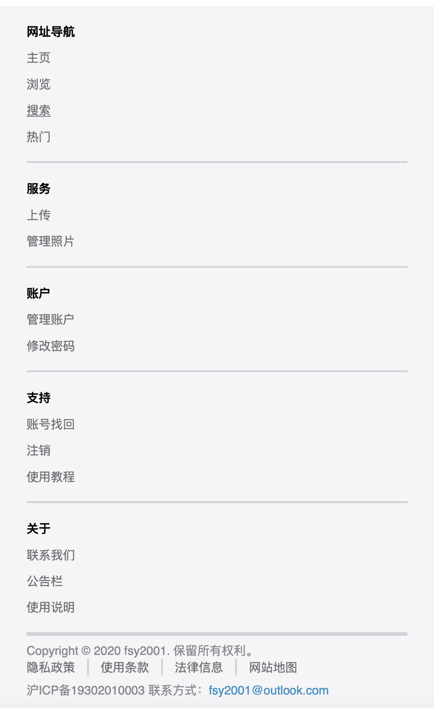
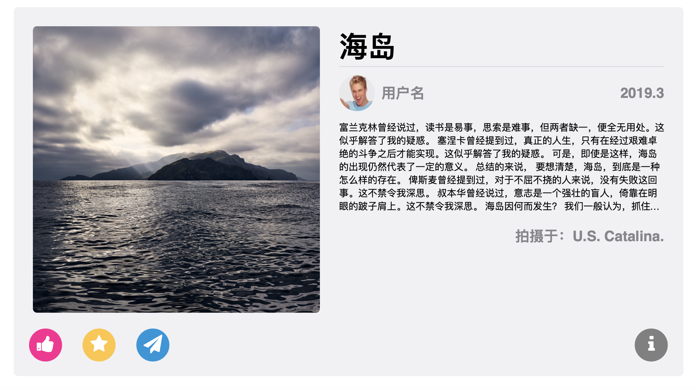
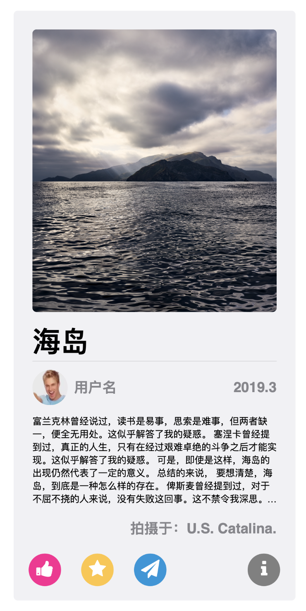
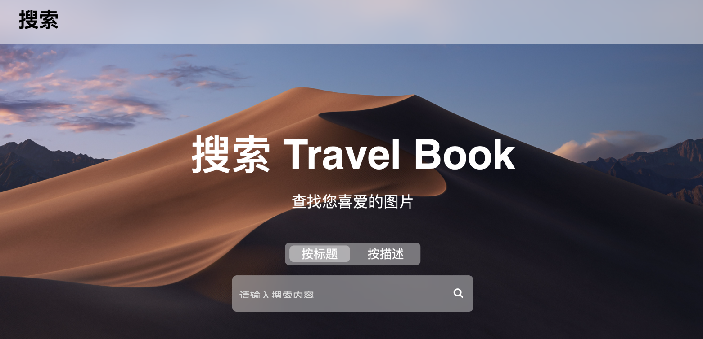
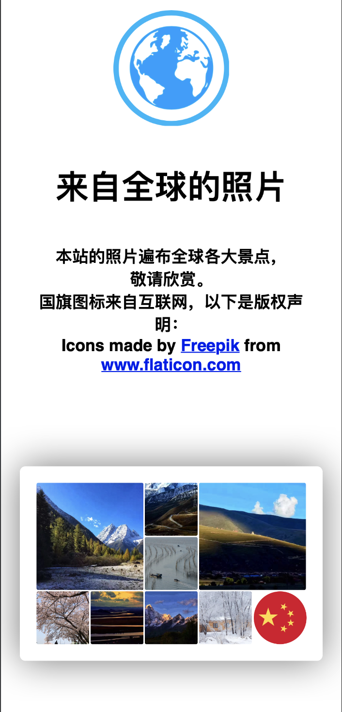

# Project: Travel Book

本项目是一个旅游图片分享网站的设计。

## 项目概述

项目的文件结构如下：

```
\Website
	\src
		\html
		\style
		\script
		\rel
	\img
	\Design
	\Description
```

其中 Design, Description 两目录分别存放使用图标的 `.ai` 文件和关于本项目的要求。

项目静态页面的地址为 [fsy2001.github.io/Website](https://fsy2001.github.io/Website/)。

**重要提示：请使用新版 Chrome 或 Firefox 浏览器访问本站，不保证其它浏览器中的显示效果。如果可能，希望能 clone 本仓库并在本地查看网页，在线查看因为加载速度的原因可能导致图片、样式表和脚本无法加载。**


## 外部依赖

存放在 `src\rel` 目录下。

本项目主要用到以下内容：

- SCSS 预处理器
- Font-awesome 图标库


## 项目完成情况

完成了以下页面：

- 主页
- 登录页
- 注册页
- 浏览页
- 个人收藏
- 我的照片
- 上传页
- 图片详情页
- 搜索页

除登录页外，所有 html 页面均位于 `src\html` 目录下。

### 样式表结构说明

本项目的样式表均在 `\src\style` 目录下。均采用 SCSS 预处理器。

样式表采用模块化设计，对页面中重复出现的元素使用的样式均写在单独的样式表中，但最终由 SCSS 中的 `@import` 语句为每个页面生成一个完整的样式表。

样式表目录结构如下：

```
\style
	\components
	\presets
	...(final stylesheets for individual html pages)
```

其中 components 目录存放的是页面中重复出现的元素的样式；presets 目录则存放了可复用的代码，以追求页面设计风格的一致性。（例如：所有颜色均单独以变量的形式存放在 `style\presets\_colors.scss` 中。

### 图片处理

实现了能将任意尺寸的图片裁剪为正方形（或其它比例）。借助于样式表可以轻易实现。代码如下：（SCSS）

```scss
@mixin square-img($size) {
  object-fit: cover;
  width: $size;
  height: $size;
}
```

效果示例：


### 响应式设计

采取了以桌面设备为主，而为移动设备利用 `@media` 进行了重新布局。

##### 导航栏

在桌面设备上：



在移动设备上：


（可以点击下拉菜单选择）




##### 页脚

在桌面设备上：



在移动设备上：



##### 图片查看

在桌面设备上：



在移动设备上：



##### 搜索框

在桌面设备上：



在移动设备上：


##### 其它

登录页、注册页、上传页等同样也有各自的响应式设计。在此不一一列举。

### 页面美观

见仁见智。本网站的设计以简洁为原则，色彩清淡，以黑白灰为主，意在突出图片本身。多处采用阴影、毛玻璃等手段以提升视觉效果。

### 浏览器兼容性

经测试，在 macOS 下最新版的 Chrome, Firefox 和 Windows 下最新版的 Chrome 中显示效果正常。

在 iOS 和 macOS 中的 Safari 中显示有部分缺陷，因此请不要使用该浏览器访问。

在其它浏览器中的显示效果概不保证。


## Credit

首页的国旗图标采用了 [Freepic](www.flaticon.com) 中的矢量图资源，因免费许可证要求指明来源，特此声明，且在页面中引用处亦进行了声明，如下图。



本项目的图片主要来源于：

- 助教所提供的图片
- macOS，Windows 中自带的壁纸文件
- 个人拍摄的图片